> Why make malware when Hacking Team can do it for you - Lazarus (probably)

## Background

About a week ago, I made this absolute banger of a tweet to tease this blog post.



On 12/09/2022, the following crypto themed CHM file was [submitted](https://www.virustotal.com/gui/file/96f144e71068bc98c5e73d396738d22a948d3a5e2d20ba618b5a0a758c0a7a89/detection) to VirusTotal by a South Korean user. This got me all excited because it SCREAMS Lazarus. ZScaler did a lovely writeup[^1] on a very similar campaign in April.

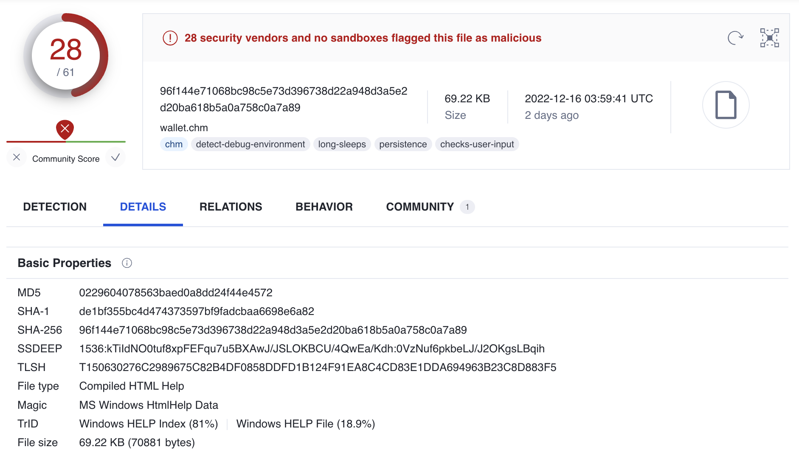

## Technical Analysis

### Stage 1: Dropper

We start off with a Compiled HTML Help (CHM) file, which is essentially a way of showing HTML natively on the desktop. Since CHM files are just archives, they can be decompiled(?) using 7-Zip allowing us to view the bundled content. If the victim opens `wallet.chm` they will see the following article about Bitcoin ([translated](https://translate.google.com/?sl=auto&tl=en&text=%EC%88%9C%EA%B2%B0%ED%95%9C%20%EB%B8%94%EB%A1%9D%EC%B2%B4%EC%9D%B8%0A%0A%20%20%0A%0A%20%20%0A%0A%EB%B8%94%EB%A1%9D%EC%B2%B4%EC%9D%B8%ED%95%98%EB%A9%B4%20%EB%AD%90%EA%B0%80%20%EB%96%A0%EC%98%A4%EB%A5%B4%EC%8B%9C%EB%82%98%EC%9A%94%3F%20%EB%84%A4%2C%20%EB%A7%8E%EC%9D%80%20%EB%B6%84%EB%93%A4%EC%9D%B4%20%EB%B9%84%ED%8A%B8%EC%BD%94%EC%9D%B8%EC%9D%84%20%EC%97%B0%EC%83%81%ED%95%A9%EB%8B%88%EB%8B%A4.%20%0A%0A%EB%B9%84%ED%8A%B8%EC%BD%94%EC%9D%B8%EC%9D%80%20%EB%B8%94%EB%A1%9D%EC%B2%B4%EC%9D%B8%EC%9D%84%20%EA%B8%B0%EB%B0%98%EC%9C%BC%EB%A1%9C%20%ED%95%9C%20%EC%95%94%ED%98%B8%ED%99%94%ED%8F%90%EC%A3%A0.%20%EA%B7%B8%EB%9F%B0%EB%8D%B0%20%EC%9D%B4%20%EC%95%94%ED%98%B8%ED%99%94%ED%8F%90%EC%97%90%20%EB%8C%80%ED%95%9C%20%EC%9D%B4%EB%AF%B8%EC%A7%80%EA%B0%80%20%EC%A2%8B%EC%A7%80%20%EC%95%8A%EC%8A%B5%EB%8B%88%EB%8B%A4.%20%0A2017%EB%85%84%20%EB%B9%84%ED%8A%B8%EC%BD%94%EC%9D%B8%20%EA%B4%91%ED%92%8D%EC%9D%84%20%EA%B8%B0%EC%96%B5%ED%95%98%EC%8B%9C%EB%82%98%EC%9A%94%3F%EC%A3%BC%EC%9C%84%EC%97%90%EC%84%9C%20%EC%8B%AC%EC%8B%AC%EC%B9%98%20%EC%95%8A%EA%B2%8C%20%EB%B9%84%ED%8A%B8%EC%BD%94%EC%9D%B8%20%ED%88%AC%EC%9E%90%EB%A1%9C%20%EB%AA%87%EC%96%B5%EC%9D%84%20%EB%B2%8C%EC%97%88%EB%8B%A4%EB%8A%90%EB%8B%88%20%EC%9E%83%EC%97%88%EB%8B%A4%EB%8A%90%EB%8B%88%20%ED%95%98%EB%8A%94%20%EC%86%8C%EC%8B%9D%EC%9D%84%20%EB%93%A4%EC%9D%84%20%EC%88%98%20%EC%9E%88%EC%97%88%EC%A3%A0.%20%EC%8B%A0%EB%AC%B8%EC%97%90%EC%84%9C%EB%8A%94%20%EC%9D%B4%EB%9F%B0%20%EB%B9%84%ED%8A%B8%EC%BD%94%EC%9D%B8%20%EA%B4%91%ED%92%8D%EC%9D%84%20%ED%88%AC%EA%B8%B0%EB%9D%BC%EA%B3%A0%20%ED%96%88%EC%8A%B5%EB%8B%88%EB%8B%A4.%EA%B7%B8%EB%A0%87%EB%8B%A4%EB%A9%B4%20%EC%99%9C%20%EC%82%AC%EB%9E%8C%EB%93%A4%EC%9D%80%20%EB%B9%84%ED%8A%B8%EC%BD%94%EC%9D%B8%EC%97%90%20%ED%88%AC%EA%B8%B0%ED%96%88%EC%9D%84%EA%B9%8C%EC%9A%94%3F%20%EB%8C%80%EB%B6%80%EB%B6%84%EC%9D%80%20%EC%9D%BC%ED%99%95%EC%B2%9C%EA%B8%88%20%EA%B8%B0%EB%8C%80%EC%97%90%20%EB%82%A8%EB%93%A4%EC%9D%84%20%EB%94%B0%EB%9D%BC%ED%95%98%EB%8B%A4%20%EB%A7%8E%EC%9D%80%20%EB%8F%88%EC%9D%84%20%EC%9E%83%EC%97%88%EA%B2%A0%EC%A3%A0.%20%ED%95%98%EC%A7%80%EB%A7%8C%20%EC%B4%88%EA%B8%B0%20%ED%88%AC%EC%9E%90%EC%9E%90%EB%93%A4%EC%9D%80%20%EB%B9%84%ED%8A%B8%EC%BD%94%EC%9D%B8%EC%97%90%EC%84%9C%20%EB%AD%94%EA%B0%80%20%EA%B0%80%EC%B9%98%EB%A5%BC%20%EB%B0%9C%EA%B2%AC%ED%95%9C%EA%B2%8C%20%EB%B6%84%EB%AA%85%ED%95%A9%EB%8B%88%EB%8B%A4.%20%EC%9C%A0%EC%8B%9C%EB%AF%BC%20%EC%9E%91%EA%B0%80%EB%8A%94%20%EC%95%94%ED%98%B8%ED%99%94%ED%8F%90%EA%B0%80%20%EB%82%9C%ED%95%B4%ED%95%98%EA%B3%A0%20%EC%9A%B0%EC%95%84%ED%95%9C%20%EC%82%AC%EA%B8%B0%EB%9D%BC%EA%B3%A0%20%EB%A7%90%ED%96%88%EC%8A%B5%EB%8B%88%EB%8B%A4.%20%EC%9D%B4%EC%97%90%20%EB%A7%9E%EC%84%9C%20%EC%A0%80%EB%8A%94%20%EC%95%94%ED%98%B8%ED%99%94%ED%8F%90%EC%99%80%20%EB%B8%94%EB%A1%9D%EC%B2%B4%EC%9D%B8%EC%9D%98%20%EC%88%9C%EA%B2%B0%ED%95%A8%EC%9D%84%20%EB%8C%80%EB%B3%80%ED%95%98%EA%B3%A0%EC%9E%90%20%ED%95%A9%EB%8B%88%EB%8B%A4.%20%0A%0A%EC%9A%B0%EB%A6%AC%EB%8A%94%20%EB%A8%BC%EC%A0%80%20%ED%99%94%ED%8F%90%EC%9D%98%20%EC%97%AD%EC%82%AC%EB%A5%BC%20%EC%82%B4%ED%8E%B4%EB%B4%90%EC%95%BC%20%ED%95%A9%EB%8B%88%EB%8B%A4.%20%EC%98%A4%EB%9E%98%20%EC%A0%84%20%EC%9D%B8%EB%A5%98%EB%8A%94%20%EC%A1%B0%EA%B0%9C%EA%BB%8D%EC%A7%88%2C%20%EA%B3%A1%EC%8B%9D%2C%20%EA%B8%88%20%EB%93%B1%EC%9D%98%20%EC%8B%A4%EB%AC%BC%EC%9D%84%20%ED%99%94%ED%8F%90%EB%A1%9C%20%EC%82%AC%EC%9A%A9%ED%96%88%EC%A3%A0.%20%EA%B7%B8%EB%9F%AC%EB%8B%A4%20%EA%B7%B8%EB%9F%AC%ED%95%9C%20%EC%8B%A4%EB%AC%BC%EC%97%90%20%EB%8C%80%ED%95%9C%20%EA%B5%90%ED%99%98%20%EC%A6%9D%EC%84%9C%EA%B0%80%20%ED%99%94%ED%8F%90%EA%B0%80%20%EB%90%98%EC%97%88%EA%B3%A0%2C%20%ED%98%84%EB%8C%80%EC%97%90%20%EB%93%A4%EC%96%B4%EC%84%9C%EB%8A%94%20%EC%8B%A4%EB%AC%BC%EC%9D%B4%EB%8D%98%20%EA%B8%88%20%EA%B5%90%ED%99%98%EB%8F%84%20%EB%B3%B4%EC%9E%A5%ED%95%B4%EC%A3%BC%EC%A7%80%20%EC%95%8A%EB%8A%94%20%EB%B6%88%ED%83%9C%ED%99%98%20%ED%99%94%ED%8F%90%EA%B0%80%20%EB%90%98%EC%97%88%EC%8A%B5%EB%8B%88%EB%8B%A4.%20%EA%B7%B8%EB%9F%BC%EC%97%90%EB%8F%84%20%EC%9A%B0%EB%A6%AC%EB%8A%94%20%EB%B3%84%20%EB%AC%B8%EC%A0%9C%20%EC%97%86%EC%9D%B4%20%ED%99%94%ED%8F%90%EB%A5%BC%20%EC%82%AC%EC%9A%A9%ED%95%A9%EB%8B%88%EB%8B%A4.%20%EC%9D%B4%EA%B2%83%EC%9D%B4%20%EA%B0%80%EB%8A%A5%ED%95%9C%20%EC%9D%B4%EC%9C%A0%EB%8A%94%20%EB%AC%B4%EC%97%87%EC%9D%BC%EA%B9%8C%EC%9A%94%3F%20%EC%A0%95%EB%B6%80%EA%B0%80%20%EB%B3%B4%EC%A6%9D%ED%95%B4%EC%A3%BC%EA%B8%B0%20%EB%95%8C%EB%AC%B8%EC%97%90%20%EC%8B%A0%EB%A2%B0%ED%95%98%EB%8A%94%20%EA%B2%83%EC%9E%85%EB%8B%88%EB%8B%A4.%20%0A%0A%EA%B7%B8%EB%A0%87%EB%8B%A4%EB%A9%B4%20%EB%B9%84%ED%8A%B8%EC%BD%94%EC%9D%B8%EB%8F%84%20%EC%8B%A0%EB%A2%B0%ED%95%A0%20%EC%88%98%20%EC%9E%88%EC%9D%84%EA%B9%8C%EC%9A%94%3F%20%EB%B9%84%ED%8A%B8%EC%BD%94%EC%9D%B8%EC%9D%84%20%EC%8B%A0%EB%A2%B0%ED%95%A0%20%EC%88%98%20%EC%9E%88%EB%8A%94%20%EC%9D%B4%EC%9C%A0%EB%8A%94%20%EA%B7%B8%20%EA%B8%B0%EB%B0%98%EC%9D%98%20%EB%B8%94%EB%A1%9D%EC%B2%B4%EC%9D%B8%20%EB%8D%95%EB%B6%84%EC%9E%85%EB%8B%88%EB%8B%A4.%20%EC%97%AC%EB%9F%AC%EB%B6%84%2C%20%ED%8E%AD%EC%88%98%EA%B0%80%20%EB%BD%80%EB%A1%9C%EB%A1%9C%EC%97%90%EA%B2%8C%20100%EC%9B%90%EC%9D%84%20%EC%86%A1%EA%B8%88%ED%95%98%EB%8A%94%20%EA%B1%B0%EB%9E%98%EA%B0%80%20%EB%B0%9C%EC%83%9D%ED%96%88%EB%8B%A4%EA%B3%A0%20%EC%B9%A9%EC%8B%9C%EB%8B%A4.%20%EA%B7%B8%EB%9F%BC%20%EC%A4%91%EC%95%99%EC%9D%98%20%EC%9D%80%ED%96%89%EC%9D%B4%20%ED%8E%AD%EC%88%98%EC%9D%98%20%EA%B3%84%EC%A2%8C%EC%97%90%EC%84%9C%20100%EC%9B%90%EC%9D%84%20%EC%B0%A8%EA%B0%90%ED%95%98%EA%B3%A0%2C%20%EB%BD%80%EB%A1%9C%EB%A1%9C%EC%9D%98%20%EA%B3%84%EC%A2%8C%EC%97%90%20100%EC%9B%90%EC%9D%84%20%EB%8D%94%ED%95%98%EA%B2%A0%EC%A3%A0.%20%EC%9D%B4%EB%A0%87%EA%B2%8C%20%EB%AA%A8%EB%93%A0%20%EA%B1%B0%EB%9E%98%20%EB%8D%B0%EC%9D%B4%ED%84%B0%EA%B0%80%20%EC%A4%91%EC%95%99%EC%9D%98%20%EC%9D%80%ED%96%89%20%EC%84%9C%EB%B2%84%EC%97%90%20%EB%B3%B4%EA%B4%80%EB%90%A9%EB%8B%88%EB%8B%A4.%20%EA%B7%B8%EB%9F%B0%EB%8D%B0%20%EB%A7%8C%EC%95%BD%20%ED%95%B4%EC%BB%A4%EB%93%A4%EC%9D%B4%20%EC%9D%B4%20%EB%8B%A8%EC%9D%BC%EC%A7%80%EC%A0%90%EC%9D%84%20%EA%B3%B5%EA%B2%A9%ED%95%9C%EB%8B%A4%EB%A9%B4%20%EB%8D%B0%EC%9D%B4%ED%84%B0%EB%8A%94%20%EC%96%B4%EB%96%BB%EA%B2%8C%20%EB%90%A0%EA%B9%8C%EC%9A%94%3F%20%EC%9C%84%2F%EB%B3%80%EC%A1%B0%EA%B0%80%20%EB%90%98%EC%96%B4%20%ED%95%B4%EC%BB%A4%EC%9D%98%20%EA%B3%84%EC%A2%8C%EC%97%90%20%EB%A7%8E%EC%9D%80%20%EB%8F%88%EC%9D%B4%20%EC%9D%B4%EC%B2%B4%EB%90%98%EA%B2%A0%EC%A3%A0.%0A%0A%EB%B0%98%EB%A9%B4%20%EB%B8%94%EB%A1%9D%EC%B2%B4%EC%9D%B8%EC%9D%80%20%EC%9D%B4%EB%9F%AC%ED%95%9C%20%EB%8B%A8%EC%9D%BC%EC%A7%80%EC%A0%90%EC%9D%B4%20%EC%97%86%EC%8A%B5%EB%8B%88%EB%8B%A4.%20%ED%8E%AD%EC%88%98%EA%B0%80%20%EB%BD%80%EB%A1%9C%EB%A1%9C%EC%97%90%EA%B2%8C%20100%EC%9B%90%EC%9D%84%20%EC%86%A1%EA%B8%88%ED%95%9C%20%EA%B8%B0%EB%A1%9D%EC%9D%84%20%EC%A4%91%EC%95%99%EC%9D%98%20%EC%9D%80%ED%96%89%EC%9D%B4%20%EC%95%84%EB%8B%8C%20%EC%97%AC%EB%9F%AC%20%EA%B3%B3%EC%97%90%20%EC%A0%80%EC%9E%A5%ED%95%98%EC%A3%A0.%20%EA%B0%99%EC%9D%80%20%EA%B8%B0%EB%A1%9D%EC%9D%84%20%EC%9D%B4%EC%A4%91%ED%99%94%2C%20%EC%82%BC%EC%A4%91%ED%99%94%EA%B0%80%20%EC%95%84%EB%8B%88%EB%9D%BC%20%EC%88%98%EB%A7%8C%EC%A4%91%ED%99%94%ED%95%98%EC%97%AC%20%EB%B6%84%EC%82%B0%20%EC%A0%80%EC%9E%A5%ED%95%98%EA%B3%A0%20%EC%9D%B4%EB%A5%BC%20%EC%8B%A4%EC%8B%9C%EA%B0%84%20%EB%8F%99%EA%B8%B0%ED%99%94%ED%95%A9%EB%8B%88%EB%8B%A4.%20%EB%8B%A8%EC%9D%BC%EC%A7%80%EC%A0%90%EC%9D%B4%20%EC%97%86%EA%B8%B0%20%EB%95%8C%EB%AC%B8%EC%97%90%20%ED%95%B4%EC%BB%A4%EB%93%A4%EC%9D%B4%20%EC%96%B4%EB%94%94%EB%A5%BC%20%EA%B3%B5%EA%B2%A9%ED%95%B4%EC%95%BC%20%ED%95%A0%EC%A7%80%20%EB%82%9C%EA%B0%90%ED%95%9C%20%EC%83%81%ED%99%A9%EC%9D%B4%20%EB%90%98%EC%A3%A0.%20%EB%B8%94%EB%A1%9D%EC%B2%B4%EC%9D%B8%EC%9D%84%20%EC%8B%A0%EB%A2%B0%ED%95%A0%20%EC%88%98%20%EC%9E%88%EB%8A%94%20%EC%B2%AB%EB%B2%88%EC%A7%B8%20%EC%9D%B4%EC%9C%A0%EB%8A%94%20%EC%9D%B4%EB%9F%B0%20%EB%8B%A4%EC%A4%91%ED%99%94%EC%9E%85%EB%8B%88%EB%8B%A4.%20%EB%91%90%EB%B2%88%EC%A7%B8%2C%20%EB%B8%94%EB%A1%9D%EC%B2%B4%EC%9D%B8%EC%9D%80%20%EA%B1%B0%EB%9E%98%20%EB%8D%B0%EC%9D%B4%ED%84%B0%EB%A5%BC%20%EC%95%94%ED%98%B8%ED%99%94%ED%95%A9%EB%8B%88%EB%8B%A4.%20%EB%AA%A8%EB%93%A0%20%EB%8D%B0%EC%9D%B4%ED%84%B0%EB%8A%94%20256%EC%9E%90%EB%A6%AC%20%EA%B0%92%EC%9C%BC%EB%A1%9C%20%EC%95%94%ED%98%B8%ED%99%94%EB%90%98%EC%A3%A0.%20%EC%9D%B4%EB%A5%BC%20%E2%80%98%ED%95%B4%EC%89%AC%E2%80%99%EB%9D%BC%EA%B3%A0%20%ED%95%98%EB%8A%94%EB%8D%B0%201%EB%B6%80%ED%84%B0%20%EA%B3%84%EC%86%8D%20%EC%88%AB%EC%9E%90%EB%A5%BC%20%EB%8C%80%EC%9E%85%ED%95%B4%EC%84%9C%20256%EC%9E%90%EB%A6%AC%20%ED%8A%B9%EC%A0%95%20%EA%B0%92%EC%9D%84%20%EA%B5%AC%ED%95%98%EB%8A%94%20%EA%B2%81%EB%8B%88%EB%8B%A4.%20%EA%B7%B8%EB%9F%B0%EB%8D%B0%20%ED%95%B4%EC%89%AC%20%ED%8A%B9%EC%84%B1%EC%83%81%20%EC%97%AD%EC%9C%BC%EB%A1%9C%20%ED%8A%B9%EC%A0%95%20%EA%B0%92%EC%9D%B4%20%EB%82%98%EC%98%A4%EB%8A%94%20%ED%8A%B9%EC%A0%95%20%EC%88%AB%EC%9E%90%EB%A5%BC%20%EC%B0%BE%EC%95%84%EB%82%B4%EB%8A%94%20%EA%B2%83%EC%9D%80%20%EB%B6%88%EA%B0%80%EB%8A%A5%ED%95%A9%EB%8B%88%EB%8B%A4.%20%EB%A7%88%EC%B9%98%20%EC%9A%B0%EB%A6%AC%EA%B0%80%20%ED%95%B8%EB%93%9C%ED%8F%B0%204%EC%9E%90%EB%A6%AC%20%EB%B9%84%EB%B0%80%EB%B2%88%ED%98%B8%EB%A5%BC%201%EB%B6%80%ED%84%B0%209%EA%B9%8C%EC%A7%80%20%EC%88%98%EC%97%86%EC%9D%B4%20%EC%9E%85%EB%A0%A5%ED%95%B4%EC%84%9C%20%EA%B2%B0%EA%B5%AD%205392%EB%9D%BC%EB%8A%94%20%EB%B9%84%EB%B0%80%EB%B2%88%ED%98%B8%EB%A5%BC%20%EB%A7%9E%EC%B6%9C%20%EC%88%98%20%EC%9E%88%EC%A7%80%EB%A7%8C%2C%20%EC%97%AD%EC%9C%BC%EB%A1%9C%205392%EB%9D%BC%EB%8A%94%20%EB%B9%84%EB%B0%80%EB%B2%88%ED%98%B8%EB%A5%BC%20%EA%B0%80%EC%A7%84%20%ED%95%B8%EB%93%9C%ED%8F%B0%EC%9D%84%20%EC%B0%BE%EC%95%84%EB%82%B4%EB%8A%94%20%EA%B1%B4%20%EB%B6%88%EA%B0%80%EB%8A%A5%ED%95%9C%20%EA%B2%83%EA%B3%BC%20%EA%B0%99%EC%8A%B5%EB%8B%88%EB%8B%A4.%20%EC%A6%89%2C%20%EC%95%94%ED%98%B8%ED%99%94%20%EB%90%9C%20%EC%9D%B4%EC%83%81%2C%20%EC%97%AD%EC%9C%BC%EB%A1%9C%20%EB%8D%B0%EC%9D%B4%ED%84%B0%20%EC%9C%84%EC%A1%B0%EA%B0%80%20%EB%B6%88%EA%B0%80%EB%8A%A5%ED%95%98%EC%A3%A0.%20%0A%0A%EC%84%B8%EB%B2%88%EC%A7%B8%2C%20%EB%B8%94%EB%A1%9D%EC%B2%B4%EC%9D%B8%EC%9D%80%20%EA%B1%B0%EB%9E%98%20%EB%8D%B0%EC%9D%B4%ED%84%B0%EB%A5%BC%20%EC%97%B0%EA%B2%B0%ED%99%94%ED%95%A9%EB%8B%88%EB%8B%A4.%20%EB%B8%94%EB%A1%9D%EC%B2%B4%EC%9D%B8%EC%9D%80%20%ED%95%B4%EC%89%AC%EB%90%9C%20%EB%8D%B0%EC%9D%B4%ED%84%B0%201800%EA%B0%9C%EB%A5%BC%20%ED%95%9C%20%EB%B8%94%EB%A1%9D%EC%97%90%20%EC%A0%80%EC%9E%A5%ED%95%98%EB%8A%94%EB%8D%B0%EC%9A%94.%202%EA%B0%9C%EC%9D%98%20%ED%95%B4%EC%89%AC%EB%A5%BC%20%EB%8B%A4%EC%8B%9C%20%ED%95%B4%EC%89%AC%ED%95%98%EB%8A%94%20%EB%B0%A9%EC%8B%9D%EC%9C%BC%EB%A1%9C%20%EC%B5%9C%EC%A2%85%20%ED%95%B4%EC%89%AC%EB%A5%BC%20%EA%B5%AC%ED%95%98%EA%B3%A0%20%EC%9D%B4%EB%A5%BC%20%EB%8B%A4%EC%9D%8C%20%EB%B8%94%EB%A1%9D%EC%97%90%20%EC%A0%80%EC%9E%A5%ED%95%98%EB%8A%94%20%EB%B0%A9%EC%8B%9D%EC%9C%BC%EB%A1%9C%20%EB%B8%94%EB%A1%9D%EB%93%A4%EC%9D%B4%20%EC%B2%B4%EC%9D%B8%EC%B2%98%EB%9F%BC%20%EC%9D%B4%EC%96%B4%EC%A7%80%EA%B2%8C%20%EB%90%A9%EB%8B%88%EB%8B%A4.%20%EA%B7%B8%EB%9E%98%EC%84%9C%20%EB%B8%94%EB%A1%9D%2B%EC%B2%B4%EC%9D%B8%EC%9D%B4%20%EB%90%98%EB%8A%94%20%EA%B2%83%EC%9D%B4%EC%A3%A0.%20%EB%94%B0%EB%9D%BC%EC%84%9C%20%ED%95%B4%EC%BB%A4%EB%8A%94%20%ED%95%9C%20%ED%95%B4%EC%89%AC%EB%A5%BC%20%EC%A1%B0%EC%9E%91%ED%95%98%EB%A9%B4%20%EA%B7%B8%20%EC%9D%B4%ED%9B%84%EC%9D%98%20%EB%AA%A8%EB%93%A0%20%ED%95%B4%EC%89%AC%EB%93%A4%EC%9D%84%20%EB%8B%A4%20%EC%A1%B0%EC%9E%91%ED%95%B4%EC%95%BC%ED%95%98%EB%8A%94%20%EB%AC%B8%EC%A0%9C%EC%97%90%20%EC%A7%81%EB%A9%B4%ED%95%A9%EB%8B%88%EB%8B%A4.%20%EC%9D%B4%EB%A0%87%EA%B2%8C%20%EB%8B%A4%EC%A4%91%ED%99%94%2C%20%EC%95%94%ED%98%B8%ED%99%94%2C%20%EC%97%B0%EA%B2%B0%ED%99%94%EB%9D%BC%EB%8A%94%203%EA%B0%80%EC%A7%80%20%EC%9E%91%EC%97%85%EC%9D%84%20%ED%86%B5%ED%95%B4%20%EB%8D%B0%EC%9D%B4%ED%84%B0%EC%9D%98%20%EC%9C%84%2F%EB%B3%80%EC%A1%B0%EA%B0%80%20%EB%B6%88%EA%B0%80%EB%8A%A5%20%ED%95%9C%20%EA%B2%83%EC%9D%B4%20%EB%B8%94%EB%A1%9D%EC%B2%B4%EC%9D%B8%EC%9E%85%EB%8B%88%EB%8B%A4.%20%EA%B7%B8%EB%A0%87%EB%8B%A4%EB%A9%B4%20%EC%9D%B4%EB%9F%B0%20%EC%9E%91%EC%97%85%EC%9D%84%20%EB%88%84%EA%B0%80%20%ED%95%A0%EA%B9%8C%EC%9A%94%3F%20%EC%A0%84%20%EC%84%B8%EA%B3%84%EC%97%90%20%ED%9D%A9%EC%96%B4%EC%A0%B8%EC%9E%88%EB%8A%94%20%EC%BB%B4%ED%93%A8%ED%84%B0%EA%B0%80%20%ED%95%A9%EB%8B%88%EB%8B%A4.%20%EA%B7%B8%EB%9F%B0%EB%8D%B0%20%EB%A7%89%EB%8C%80%ED%95%9C%20%EC%BB%B4%ED%93%A8%ED%8C%85%20%EC%9E%91%EC%97%85%EC%9D%84%20%EA%B3%B5%EC%A7%9C%EB%A1%9C%20%ED%95%A0%EB%A6%AC%EB%8A%94%20%EC%97%86%EA%B2%A0%EC%A3%A0%3F%20%EC%BB%B4%ED%93%A8%ED%84%B0%EB%93%A4%EC%9D%80%20%EB%B8%94%EB%A1%9D%EC%B2%B4%EC%9D%B8%EC%9D%98%20%EC%8B%A0%EB%A2%B0%EC%84%B1%EC%9D%84%20%EB%86%92%EC%97%AC%EC%A4%80%20%EB%8C%80%EA%B0%80%EB%A1%9C%20%EC%95%94%ED%98%B8%ED%99%94%ED%8F%90%EB%9D%BC%EB%8A%94%20%EB%B3%B4%EC%83%81%EC%9D%84%20%EB%B0%9B%EA%B8%B0%20%EB%95%8C%EB%AC%B8%EC%97%90%20%EC%9D%B4%EC%97%90%20%EC%B0%B8%EC%97%AC%ED%95%98%EA%B2%8C%20%EB%90%A9%EB%8B%88%EB%8B%A4.%20%EB%B8%94%EB%A1%9D%EC%B2%B4%EC%9D%B8%EC%9D%84%20%EC%8B%A0%EB%A2%B0%ED%95%A0%20%EC%88%98%20%EC%9E%88%EA%B8%B0%20%EB%95%8C%EB%AC%B8%EC%97%90%20%EC%95%94%ED%98%B8%ED%99%94%ED%8F%90%EB%8F%84%20%EC%8B%A0%EB%A2%B0%ED%95%A0%20%EC%88%98%20%EC%9E%88%EB%8B%A4%EB%8A%94%20%EA%B2%83%20%EC%9D%B4%ED%95%B4%20%EB%90%98%EC%8B%9C%EB%82%98%EC%9A%94%3F%20%0A%0A%EA%B7%B8%EB%A0%87%EB%8B%A4%EB%A9%B4%20%EB%B8%94%EB%A1%9D%EC%B2%B4%EC%9D%B8%EC%9D%80%20%EB%8F%88%20%EA%B1%B0%EB%9E%98%20%EB%8D%B0%EC%9D%B4%ED%84%B0%EB%A7%8C%20%EB%8B%B4%EC%9D%84%20%EC%88%98%20%EC%9E%88%EC%9D%84%EA%B9%8C%EC%9A%94%3F%20%EA%B7%B8%EB%A0%87%EC%A7%80%20%EC%95%8A%EC%8A%B5%EB%8B%88%EB%8B%A4.%20%EC%98%A8%EA%B0%96%20%EA%B0%80%EC%B9%98%20%EC%9E%88%EB%8A%94%20%EB%8D%B0%EC%9D%B4%ED%84%B0%EB%8A%94%20%EC%A0%84%EB%B6%80%20%EB%8B%B4%EC%9D%84%20%EC%88%98%20%EC%9E%88%EC%A3%A0.%20%EB%B6%80%EB%8F%99%EC%82%B0%2C%20%EB%AC%BC%EB%A5%98%2C%20%EC%8B%A0%EC%9B%90%2C%20%EC%84%A0%EA%B1%B0%2C%20%EC%A0%80%EC%9E%91%EA%B6%8C%20%EB%93%B1.%20%EA%B7%B8%20%EC%A4%91%EC%97%90%20%EC%A0%80%EC%9E%91%EA%B6%8C%20%EB%8D%B0%EC%9D%B4%ED%84%B0%EB%8A%94%20%EC%96%B4%EB%96%BB%EA%B2%8C%20%EB%8B%B4%EA%B8%B0%EB%8A%94%EC%A7%80%20%EC%82%B4%ED%8E%B4%EB%B3%BC%EA%B9%8C%EC%9A%94%3F%20%0A%0A%ED%8E%AD%EC%88%98%EC%9D%98%20%EC%9A%94%EB%93%A4%EC%86%A1%EC%9E%85%EB%8B%88%EB%8B%A4.%20%EC%9D%B4%EB%A5%BC%20%EB%B8%94%EB%A1%9D%EC%B2%B4%EC%9D%B8%20%EC%8B%9C%EC%8A%A4%ED%85%9C%EC%97%90%20%EC%98%AC%EB%A0%B8%EB%8B%A4%EA%B3%A0%20%EC%B9%A9%EC%8B%9C%EB%8B%A4.%20%EA%B7%B8%EB%A6%AC%EA%B3%A0%20%EB%BD%80%EB%A1%9C%EB%A1%9C%EA%B0%80%20%EC%9D%B4%EB%A5%BC%20%EB%A6%AC%EB%A9%94%EC%9D%B4%ED%81%AC%20%ED%96%88%EC%8A%B5%EB%8B%88%EB%8B%A4.%20%EA%B7%B8%EB%A6%AC%EA%B3%A0%20%EC%9D%B4%20%EB%A6%AC%EB%A9%94%EC%9D%B4%ED%81%AC%20%EA%B3%A1%EC%9D%84%20%EC%9E%A0%ED%95%9C%ED%86%A0%EA%B0%80%20%EC%82%AC%EC%9A%A9%ED%95%98%EA%B2%8C%20%EB%90%98%EC%97%88%EC%A3%A0.%20%EC%9D%B4%EB%9F%AC%ED%95%9C%20%ED%8E%AD%EC%88%98%EC%9D%98%20%EC%9A%94%EB%93%A4%EC%86%A1%20%EA%B1%B0%EB%9E%98%20%EB%8D%B0%EC%9D%B4%ED%84%B0%EB%8A%94%20%EB%AA%A8%EB%91%90%20%EC%9C%84%2F%EB%B3%80%EC%A1%B0%EA%B0%80%20%EB%B6%88%EA%B0%80%EB%8A%A5%ED%95%9C%20%EB%B8%94%EB%A1%9D%EC%B2%B4%EC%9D%B8%EC%97%90%20%EA%B8%B0%EB%A1%9D%EB%90%98%EC%96%B4%20%EC%9E%88%EA%B8%B0%20%EB%95%8C%EB%AC%B8%EC%97%90%20%EC%9E%A0%ED%95%9C%ED%86%A0%EB%8A%94%20%EC%9D%8C%EC%9B%90%EC%82%AC%EC%9A%A9%EB%A3%8C%EB%A5%BC%2C%20%EB%BD%80%EB%A1%9C%EB%A1%9C%EB%8A%94%20%EC%A0%80%EC%9E%91%EA%B6%8C%EB%A3%8C%EB%A5%BC%20%ED%8E%AD%EC%88%98%EC%97%90%EA%B2%8C%20%EC%A7%80%EA%B8%89%ED%95%A9%EB%8B%88%EB%8B%A4.%20%EC%B6%94%EC%A0%81%EC%9D%B4%20%EA%B0%80%EB%8A%A5%ED%95%98%EA%B8%B0%20%EB%95%8C%EB%AC%B8%EC%97%90%20%EC%A4%91%EA%B0%84%EC%97%90%20%EB%B3%B5%EC%9E%A1%ED%95%9C%20%EA%B1%B0%EB%9E%98%EA%B0%80%20%EC%9E%88%EC%96%B4%EB%8F%84%20%EC%88%98%EC%9E%85%20%EA%B5%AC%EC%A1%B0%EA%B0%80%20%ED%88%AC%EB%AA%85%ED%95%B4%EC%A7%80%EC%A3%A0.%0A%0A%EC%9D%B4%EB%9F%B0%20%EC%8B%9D%EC%9C%BC%EB%A1%9C%20%EB%B6%80%EB%8F%99%EC%82%B0%2C%20%EB%AC%BC%EB%A5%98%2C%20%EC%8B%A0%EC%9B%90%2C%20%EC%84%A0%EA%B1%B0%20%EB%8D%B0%EC%9D%B4%ED%84%B0%EB%8F%84%20%EC%9C%84%2F%EB%B3%80%EC%A1%B0%EA%B0%80%20%EB%B6%88%EA%B0%80%EB%8A%A5%ED%95%98%EA%B3%A0%20%EC%B6%94%EC%A0%81%EC%9D%B4%20%EA%B0%80%EB%8A%A5%ED%95%B4%EC%A7%91%EB%8B%88%EB%8B%A4.%20%EA%B7%B8%EC%95%BC%EB%A7%90%EB%A1%9C%20%EB%B8%94%EB%A1%9D%EC%B2%B4%EC%9D%B8%EC%9D%80%20%EB%AC%B4%EA%B6%81%EB%AC%B4%EC%A7%84%ED%95%9C%20%EA%B0%80%EB%8A%A5%EC%84%B1%EC%9D%84%20%EC%A7%80%EB%85%94%EB%8B%A4%EA%B3%A0%20%ED%95%A0%20%EC%88%98%20%EC%9E%88%EC%A3%A0.%20%EC%A0%84%20%EC%84%B8%EA%B3%84%EC%97%90%20%ED%9D%A9%EC%96%B4%EC%A7%84%20%EC%BB%B4%ED%93%A8%ED%84%B0%EB%93%A4%EC%9D%B4%20%EB%8D%B0%EC%9D%B4%ED%84%B0%EB%A5%BC%20%EB%8B%A4%EC%A4%91%ED%99%94%2C%20%EC%95%94%ED%98%B8%ED%99%94%2C%20%EC%97%B0%EA%B2%B0%ED%99%94%ED%95%9C%20%EB%B8%94%EB%A1%9D%EC%B2%B4%EC%9D%B8%EC%9D%80%20%EC%8B%A0%EB%A2%B0%EC%9D%98%20%EC%83%81%EC%A7%95%EC%9E%85%EB%8B%88%EB%8B%A4.%20%EC%9D%B4%EC%A0%9C%20%EB%B8%94%EB%A1%9D%EC%B2%B4%EC%9D%B8%EC%9D%B4%20%EC%82%AC%EA%B8%B0%EB%A1%9C%20%EB%AA%B0%EB%A6%B0%EA%B2%8C%20%EC%99%9C%20%EC%96%B5%EC%9A%B8%ED%95%9C%EC%A7%80%20%EC%95%84%EC%85%A8%EB%82%98%EC%9A%94%3F%20%EC%9D%B8%ED%84%B0%EB%84%B7%EB%8F%84%20%EC%B4%88%EA%B8%B0%EC%97%90%20%EB%8B%B7%EC%BB%B4%EB%B2%84%EB%B8%94%EC%9D%84%20%EA%B2%AA%EC%97%88%EC%A3%A0.%20%EB%AA%A8%EB%93%A0%20%ED%98%81%EC%8B%A0%EC%A0%81%EC%9D%B8%20%EA%B8%B0%EC%88%A0%EC%9D%80%20%EC%B4%88%EA%B8%B0%EC%97%90%20%EB%82%9C%EA%B4%80%EC%97%90%20%EB%B6%80%EB%94%AA%EC%B9%98%EA%B8%B0%20%EB%A7%88%EB%A0%A8%EC%9E%85%EB%8B%88%EB%8B%A4.%20%EC%A7%80%EA%B8%88%EA%B9%8C%EC%A7%80%20%EC%88%9C%EA%B2%B0%ED%95%9C%20%EB%B8%94%EB%A1%9D%EC%B2%B4%EC%9D%B8%EC%9D%B4%EC%97%88%EC%8A%B5%EB%8B%88%EB%8B%A4.%0A&op=translate)):  

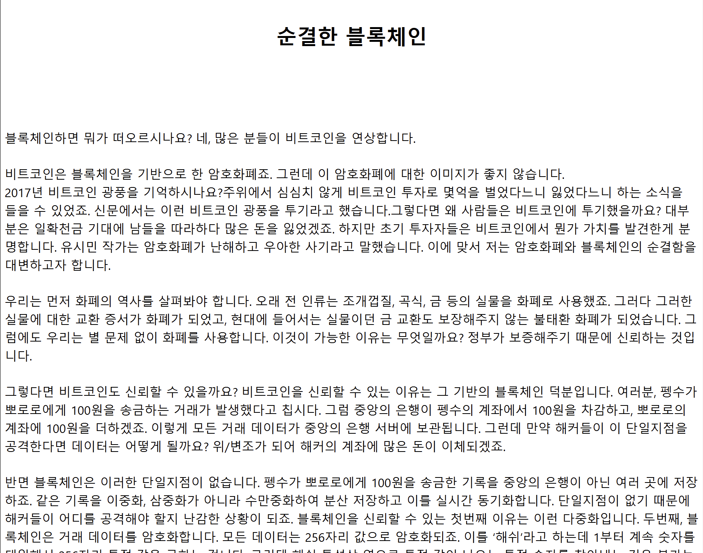

After extracting the bundled content we can see a number of files, the most important being: `page_1.html` and the `src` directory. 

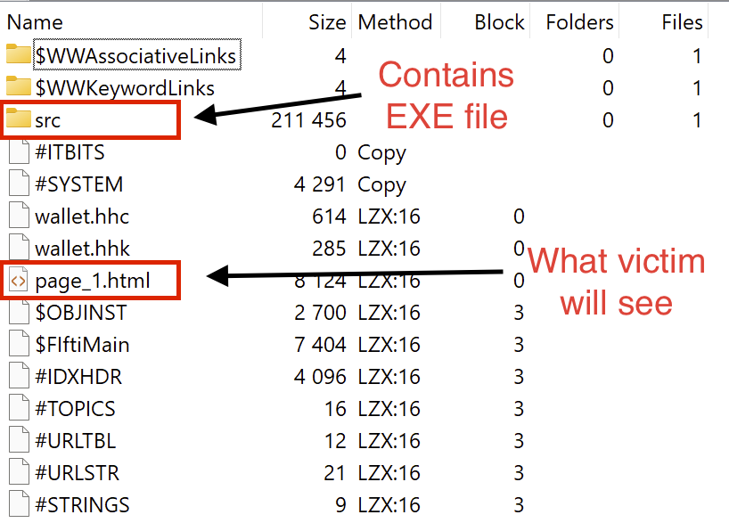

The content displayed in Fig: 1 is actually just a rendered version of `page_1.html`, and like any other HTML file, it can execute JavaScript. At the end of `page_1.html` we find some packed JS:

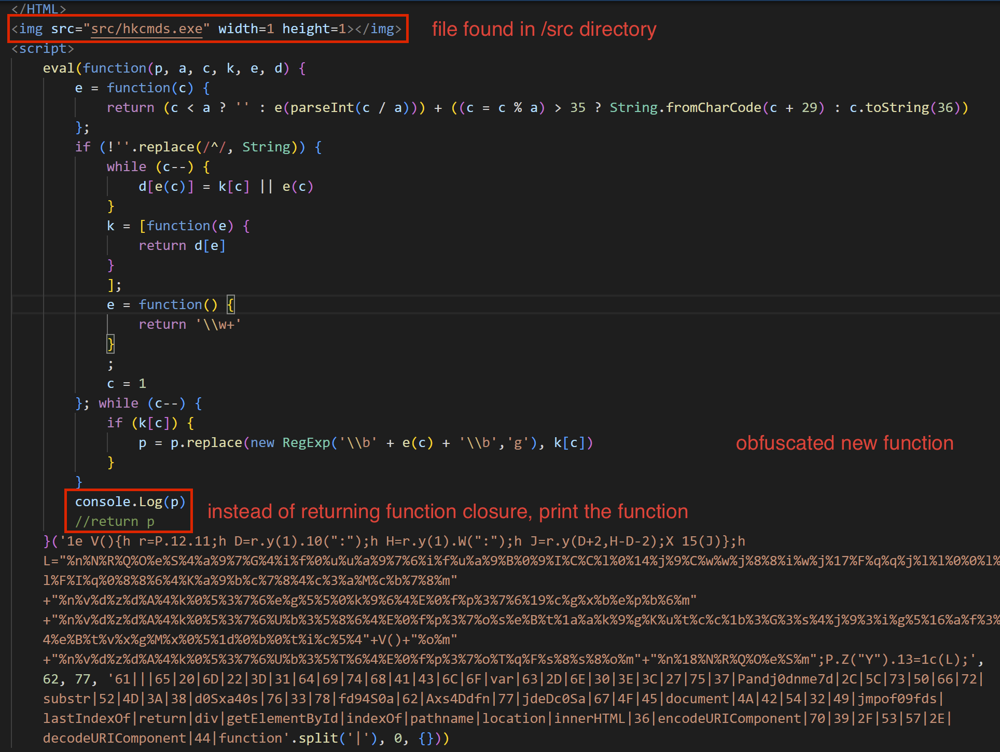

This specific JS packer has been noted in a number of NK attributed samples, and is trivial to unpack. Instead of returning the decoded function you can simply print the unpacked result. 

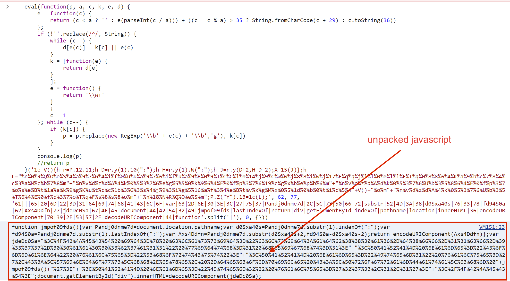

And after beautifying:

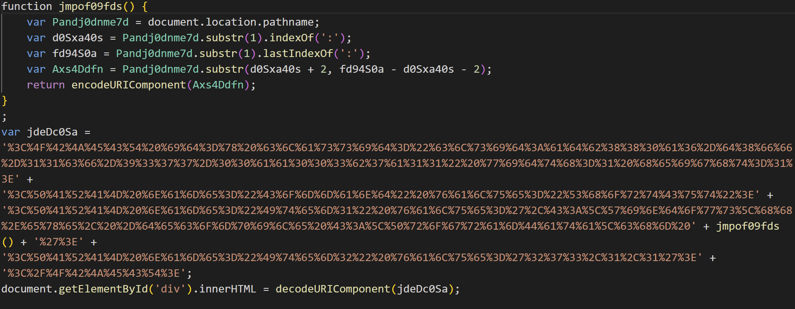

The function `jmpof09fds()` gets the location of the CHM file on disk to prepare for writing the next stage. The variable `jdeDc05a` is just a URL encoded script which after being decoded is a shortcut for decompiling `wallet.chm` to expose `hkcmds.exe` to disk:

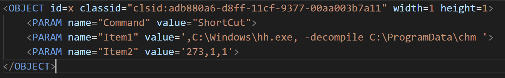

Following the JS pictured in Fig: 4, there is some more code to execute the file `hkcmds.exe`  that was included in the bundle.

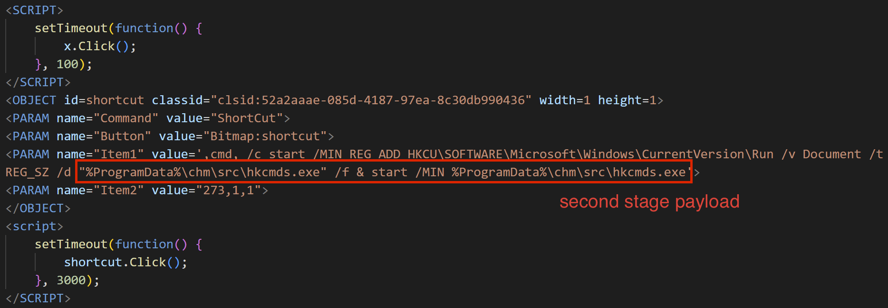

At this point, we're done with the CHM file as all the prep work for stage two has been completed. We can now move onto analyzing `hkcmds.exe`.

### Stage 2: hkcmds.exe

Throwing the binary into DetectItEasy shows it is a C/C++ binary with no packing (🥵). No extra steps necessary and we can continue on to our analysis in IDA. 

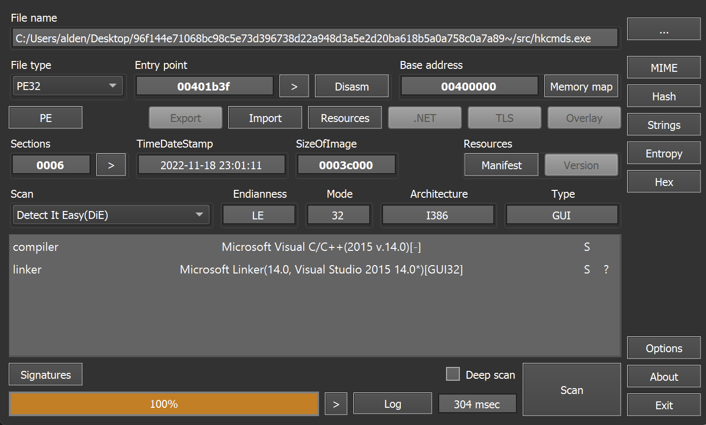

IDA helpfully identifies `WinMain` for us, so we start there. The first thing that jumps out is a number of obfuscated strings that are being fed into `sub_4018A0()`. 

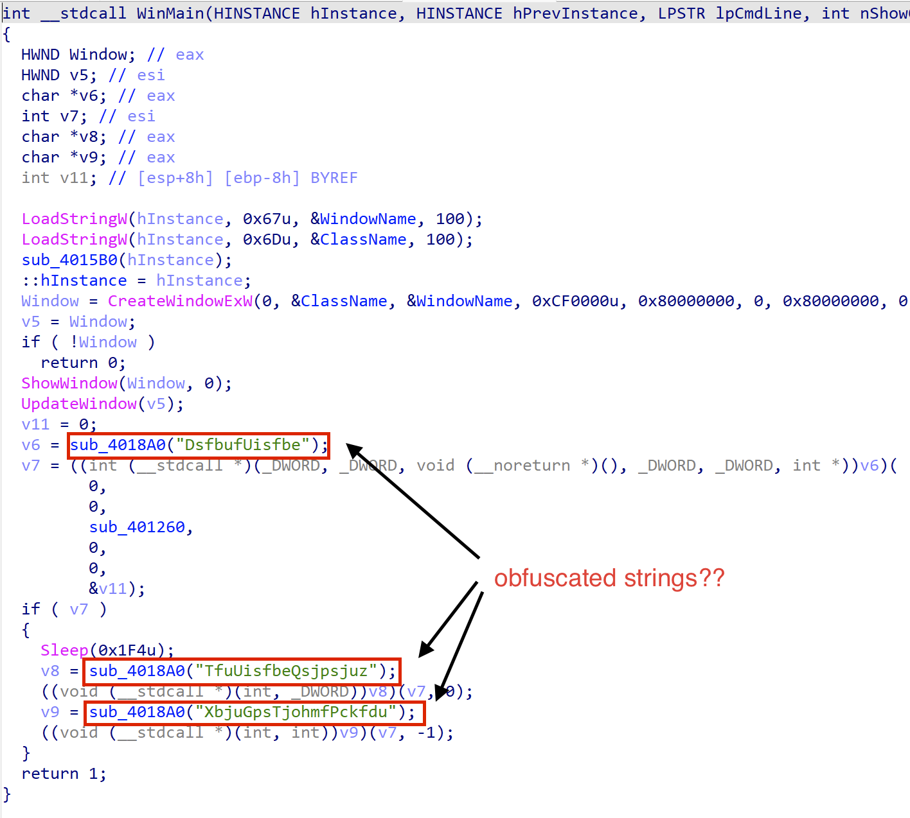

Examining the rest of the strings in the binary, we notice that there are tons of similarly obufscated strings. Just like the ones we saw above, they are all referenced by `sub_4018A0`. During a quick debug, we can see that `sub_4018A0`, miraculously returns a normal WinAPI function call! Interestingly, there are a lot similarities among the lines which means that it is probably some simple debofuscation happening.

```
...
MpdbmBmmpd
HfuMbtuFssps
Qspdftt43Ofyu
Npevmf43Ofyu
Npevmf43Gjstu
Qspdftt43Gjstu
DsfbufUppmifmq43Tobqtipu
HfuQspdBeesftt
GjoeGjstuGjmfB
HfuFowjsponfouWbsjbcmfB
HfuGjmfJogpsnbujpoCzIboemf
MpbeMjcsbszB
Qspdftt43OfyuX
Qspdftt43GjstuX
GsffMjcsbsz
HfuDvssfouQspdftt
...
```

For kicks, I threw a few of the strings into Google and was met with this... https://github.com/hackedteam/core-win32/blob/master/DynamiCall/obfuscated_calls.h and all the mappings of obfuscated function calls. thanks bestie!! 🥰 Making use of [Hacking Team](https://en.wikipedia.org/wiki/Hacking_Team) implants like a good APT should. 

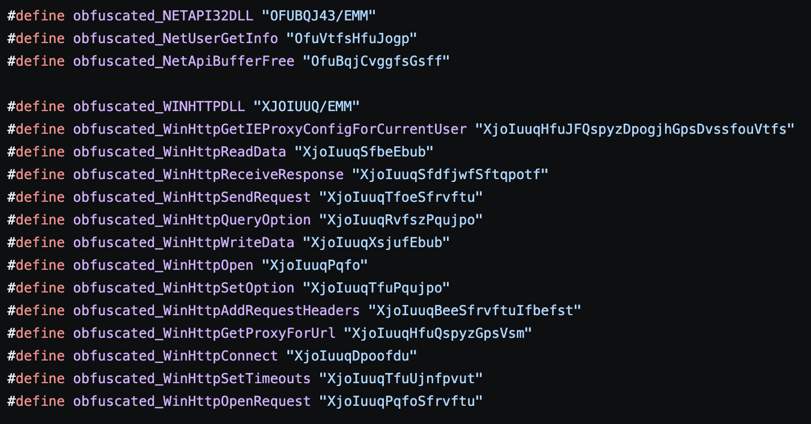

This was a great find as the repo contains source for the binary we were about to reverse! In terms of the function obfucsation, it ends up just shifting all the characters by -1. It would be a fair assumption to make that the binary we are reversing is just the RCS (remote control system) in this repo but there are some inconsistencies. 

To make the process a little easier, I wrote a quick deobfuscation script to fix up the function calls in IDA. 

```python
import idc
import idautils
import idaapi

def deobfuscate(obfuscated) -> str:
    return "".join([chr(ord(i)-1) for i in str(obfuscated)])

def iterate_strings(start_addr, end_addr):
    for i in idautils.Strings():
        # Check if the string is within the specified range
        if i.ea >= start_addr and i.ea + i.length <= end_addr:
            # Get the string content
            print(f"String at {hex(i.ea)}: {deobfuscate(i)}")
            idaapi.patch_bytes(i.ea, bytes(deobfuscate(i), 'utf-8'))

def main():
    start_addr = 0x00411A68 # Start address of obfuscation strings
    end_addr = 0x0041322E   # End address of obfuscation strings

    iterate_strings(start_addr, end_addr)

main()
```

In terms of similarities, the function `sub_401260` which is passed to the new thread in `WinMain` bears resemblence to `PollClipBoard` in [HM_ClipBoard.h](https://github.com/hackedteam/core-win32/blob/8eb1326959fcb5c727513b59b86386dae7463683/HM_ClipBoard.h). Accounting for some structural weirdness in the decompilation, these two share a very similar strcuture. With a large loop that `GetsClipboardData` and then batches it to send off. 

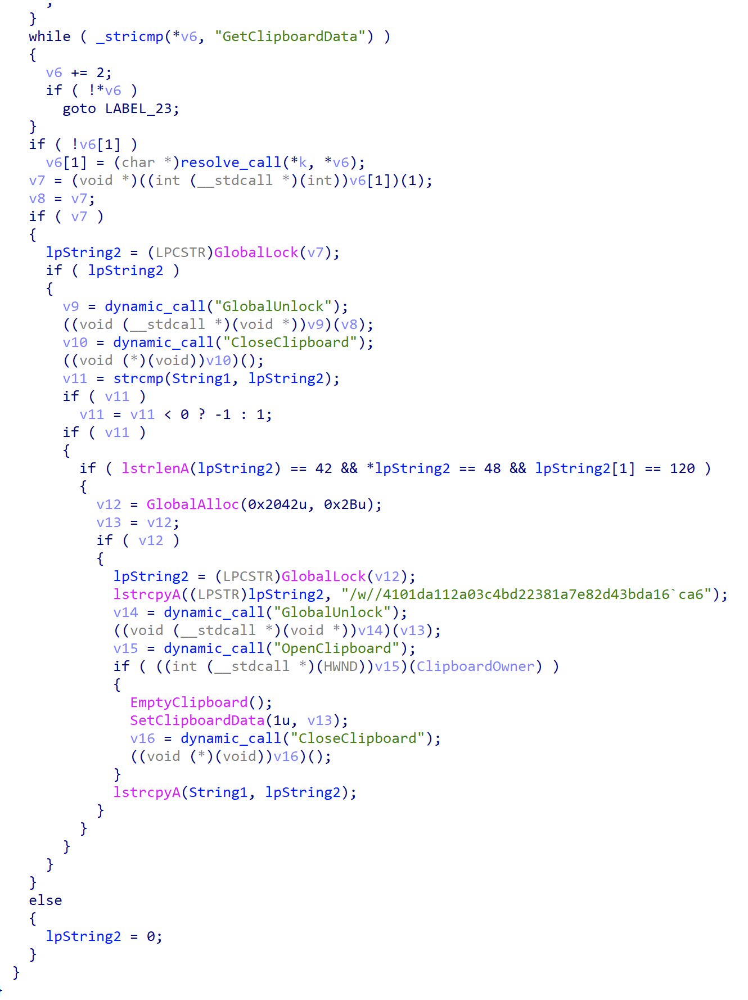

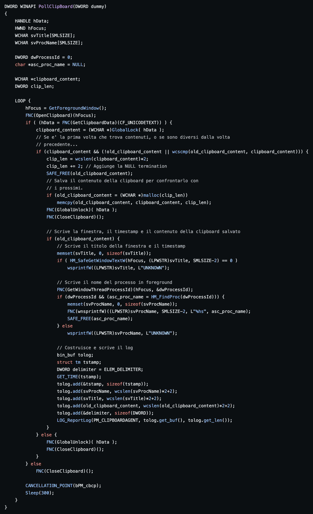

`WinMain` doesn't have any comparable code in the Hacking Team repo, so my assumption is that `hkcmds.exe` is some modified or newer version. There are also some obvious mismatches like no entry for `CreateThread` in `obfuscated_calls.h` but uses of it in `hkcmds.exe`. I'm going to continue analysis on this sample further, but it is interesting to see the use of Hacking Team tools by possible nation state actors. 

## Conclusion 

The case for attributing this malware to Lazarus or some other North Korean actor is fairly strong. Taking into consideration the locality of the submitter, the content of the document, the use of a CHM file for delivery, utilizing leaked tooling, and Akamai for infrastructure hosting; all line up with previous reports on recent Lazarus activity. 

This is the first post like this I've done in a while so if you have any feedback I'd love to hear it! Feel free to hit me up on any of my linked socials (Discord: birch#9901). Thanks for reading!  

## IOCs

### Hashes

| File Name  | SHA256                                                       |
| ---------- | ------------------------------------------------------------ |
| wallet.chm | `96f144e71068bc98c5e73d396738d22a948d3a5e2d20ba618b5a0a758c0a7a89` |
| hkcmds.exe | `442769ddce07457c55fa2eb61b145f6ad91cc1155fc2124b275e0acaf4029e2c` |

### IPs

| IP                  |
| ------------------- |
| 23[.]216[.]147[.]64 |


## References

[^1]: https://www.zscaler.com/blogs/security-research/naver-ending-game-lazarus-apt
